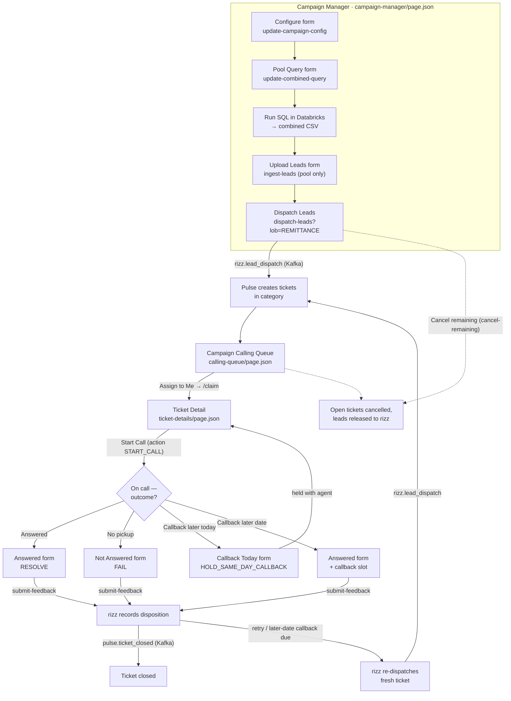

# How it works — end-to-end flow

One picture of how the three pages, their tabs and forms drive the whole
Proactive Outbound Calling loop. `client: rizz-calling` calls hit our service;
everything on `/tickets`, `/routing/shift` and the `provider:` data is Pulse-native.

**In words:** the Campaign Manager sets up the campaign and pool query → runs the
SQL in Databricks → uploads one CSV → **Dispatch** hands leads to Pulse over Kafka,
which materialises tickets. Agents work the **Queue**, open a **Ticket Detail**,
call, and file a disposition — which flows back to rizz and either closes the
ticket or schedules a retry / callback that re-dispatches. **Cancel remaining**
clears the open pool at any time.
